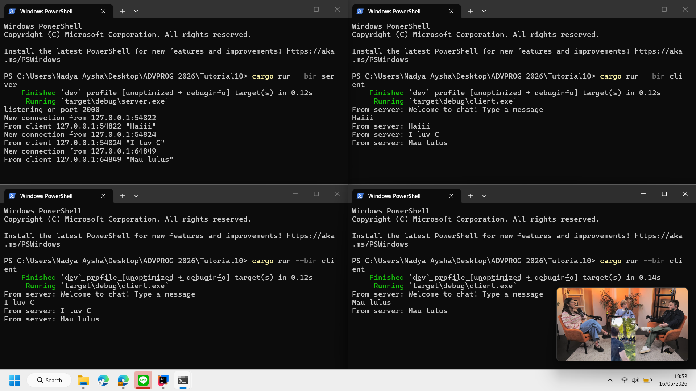
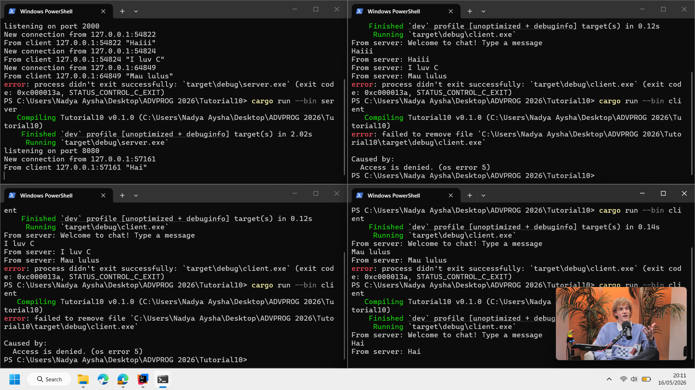
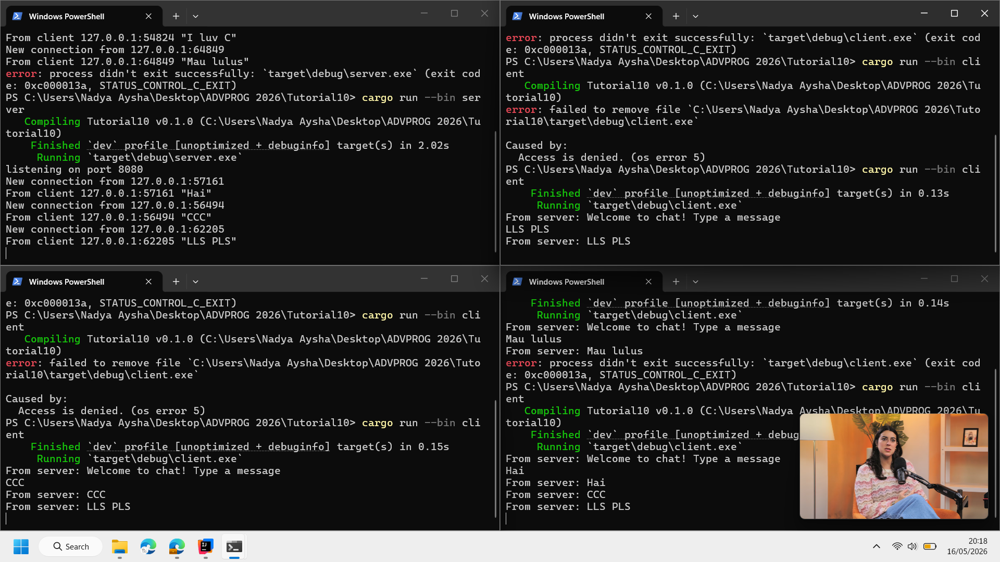
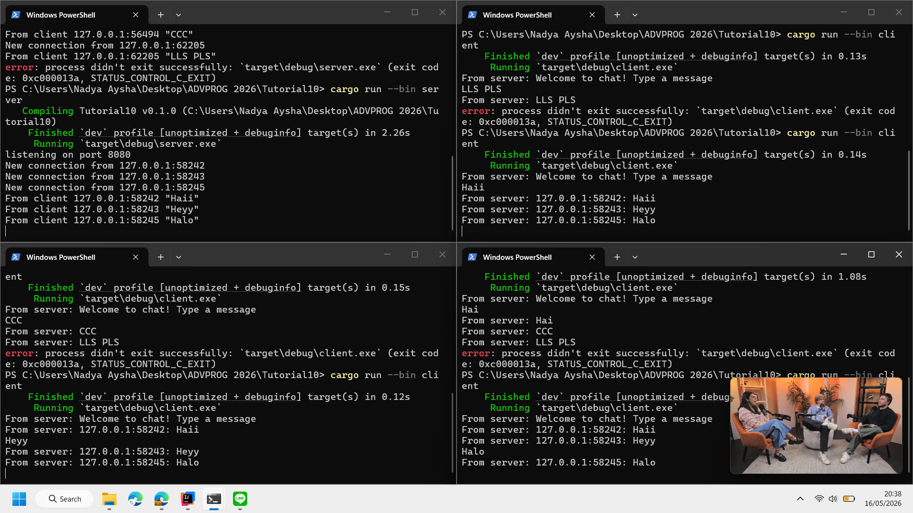

## Experiment 1.2: Understanding how it works

Ketika di-run, "hey hey" ke-print sebelum "howdy!".

Spawner.spawn nge-package blok asynchronous jadi task dan menaruhnya ke channel queue tapi tidak langsung tereksekusi.

Main thread-nya lanjut dan mengeksekusi println!("... hey hey").

Executor.run() dipanggil, yang langsung nge-pull task-task dari queue dan dikumpulin, sehingga keprint "howdy!", timer delay, dan akhirnya "done!".

## Experiment 1.3: Multiple Spawn and removing drop

### Before removing drop(spawner)

### After removing drop(spawner)

Executor-nya didesain untuk terus running selama spawner-nya ada. Kalau drop(spawner) hilang, executor-nya mikir masih ada tasks yang akan ke-spawn, jadi task queue-nya masih open dan nunggu selamanya. Nge-drop spawner akan menutup channel-nya, yang nge-signal ke executor tidak ada lagi task baru yang akan datang, membiarkan programnya ke-exit pas queue saat ini kosong.

## Experiment 2.1: Original code, and how it run

Saya run nya dengan membuka 4 terminal, 1 untuk server dan 3 untuk client, saya menegtik 3 message yang berbeda-beda. Ternyata message yang terkirim balik di client 1 adalah semua message dan di client 2 adalah message dari client 2 dan 3, serta di client 3 hanya message yang dikirim client 3.

## Experiment 2.2: Modifying port

Ketika saya run client 1 dan 2 gagal terhubung karena keduanya masih menjalankan versi program sebelumnya yang memakai port lama (2000), sedangkan Server dan Client 3 sudah di-compile dan dijalankan ulang menggunakan port yang baru (8080).

Biar semua client bisa berjalan, proses untuk Client 1 dan 2 di terminal harus dihentikan dulu lalu dijalankan ulang supaya menggunakan kode port 8080 yang sudah diperbarui.

## Experiment 2.3: Small changes, add IP and Port

Pada modifikasi ini, saya menambah logika di server untuk mengambil informasi IP dan Port pengirim (dari addr), lalu menggabungkannya dengan teks pesan menggunakan makro format! sebelum pesan di-broadcast. Hasilnya setiap client yang terhubung kini dapat melihat identitas (IP dan Port) dari pengirim di setiap pesan yang masuk.
