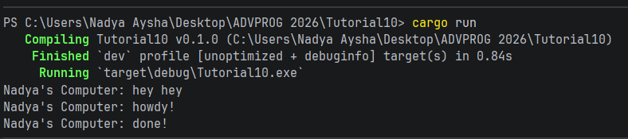
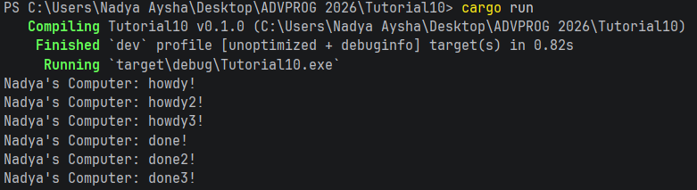
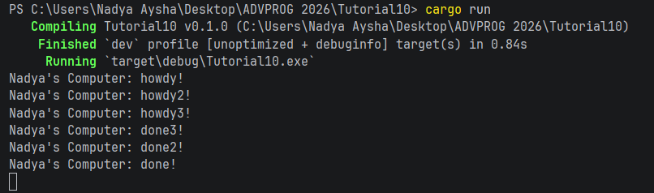

## Experiment 1.2: Understanding how it works

Ketika di-run, "hey hey" ke-print sebelum "howdy!".

Spawner.spawn nge-package blok asynchronous jadi task dan menaruhnya ke channel queue tapi tidak langsung tereksekusi.

Main thread-nya lanjut dan mengeksekusi println!("... hey hey").

Executor.run() dipanggil, yang langsung nge-pull task-task dari queue dan dikumpulin, sehingga keprint "howdy!", timer delay, dan akhirnya "done!".

## Experiment 1.3: Multiple Spawn and removing drop

### Before removing drop(spawner)

### After removing drop(spawner)

Executor-nya didesain untuk terus running selama spawner-nya ada. Kalau drop(spawner) hilang, executor-nya mikir masih ada tasks yang akan ke-spawn, jadi task queue-nya masih open dan nunggu selamanya. Nge-drop spawner akan menutup channel-nya, yang nge-signal ke executor tidak ada lagi task baru yang akan datang, membiarkan programnya ke-exit pas queue saat ini kosong.
